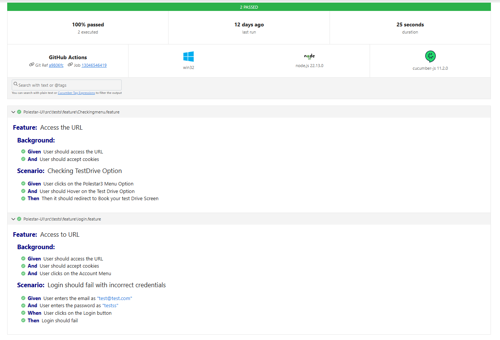
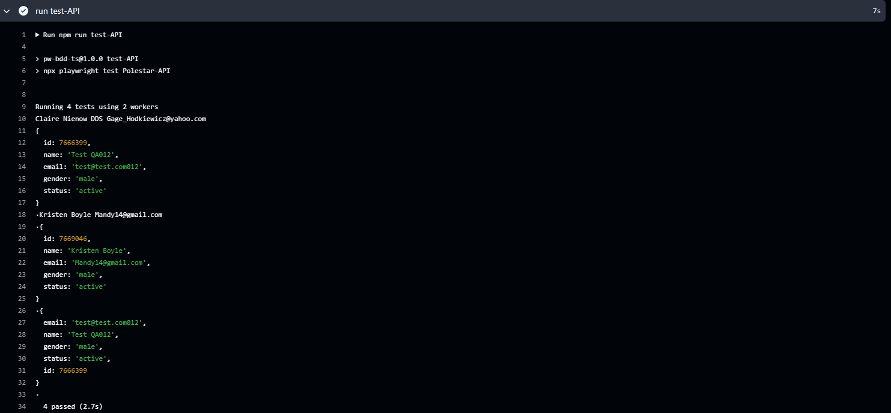
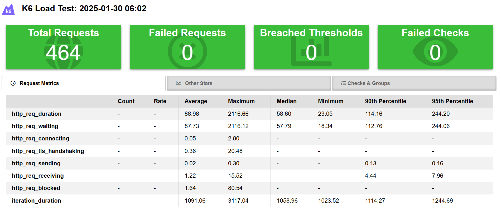

# Playwright (TS binding) + Cucumber (BDD)
For Polestar Project created Test Cases using Cucumber approach(BDD) with POM Design Pattern in TypeScript

## Features
- Cucumber Approach
- Page object model
- Parallel Execution
- Reading data from json / enum files
- Getting Environment deatils from .env file
- Sample report


## Project structure
.github -> yml file to execute the tests in GitHub Actions
src -> Contains all the features & Typescript code
test-results -> Contains all the reports related file

## Reports
- Default Cucumber report
- Logs
- Screenshots of failure

Get Started
Setup:
- Clone or download the project
- Extract and open in the VS-Code
- npm i to install the dependencies
- npx playwright install to install the browsers
- npm run test to execute the tests
To run a particular test change
  
  ```
  paths : [
            "src/test/feature/"
         ]             
Use tags to run a specific or collection of specs

```
npm run test 
```
***Folder structure***

src\pages ->   All the page (UI screen)
                                        
src\test\features-> write your features here 

src\test\steps ->  Your step definitions goes here 

src\hooks\hooks.ts -> Browser setup and teardown logic 

src\hooks\pageFixture.ts -> Simple way to share the page objects to steps 

src\helper\env -> Multiple environments are handled 

src\helper\types -> To get environment code suggestions

cucumber-report.html  -> To generate the report

config/cucumber.js -> One file to do all the magic

package.json -> Contains all the dependencies




# Playwright API Testing
For Polestar Project created API Test Cases 

## Features
- Reading data from json / enum files
- creating Dynamic data using faker files
- allure report


## Project structure
.github -> yml file to execute the tests in GitHub Actions
test-results -> Contains all the reports related file

## Reports
- allure report
- Logs

***Get Started Setup:***

- Clone or download the project
- Extract and open in the VS-Code
- npm i to install the dependencies
- npx playwright install to install the browsers
- npm run test to execute the tests
          
Use tags to run a specific or collection of specs

```
npx playwright test 
```


***Folder structure***

src\pages ->   All the page (UI screen)
                                        
src\test -> write your features here 

test-data ->  Add json request in the file




# k6
## About k6
k6 is an open source load testing tool to test the performance of APIs, microservices, and websites. Developers use k6 to test a system’s performance under a particular load to catch performance regressions or errors

## Features
- Creating Tests
- Configuring the Load
- Sample report


## Project structure
specs -> Contains all the Test Scripts and test results will be generated

## Reports
- HTML report


Get Started
Setup:
- Access to this URL -https://grafana.com/docs/k6/latest/set-up/install-k6/
- Use Download and run the latest official installer for Windows
- Open Command promt and type k6
- Go to the terminal in vs code and type below command -To execute single test
```
 k6 run <spec name/filename>
````
- To get the report run below command
```
 k6 run <spec name/filename> --out json=test.json
````

